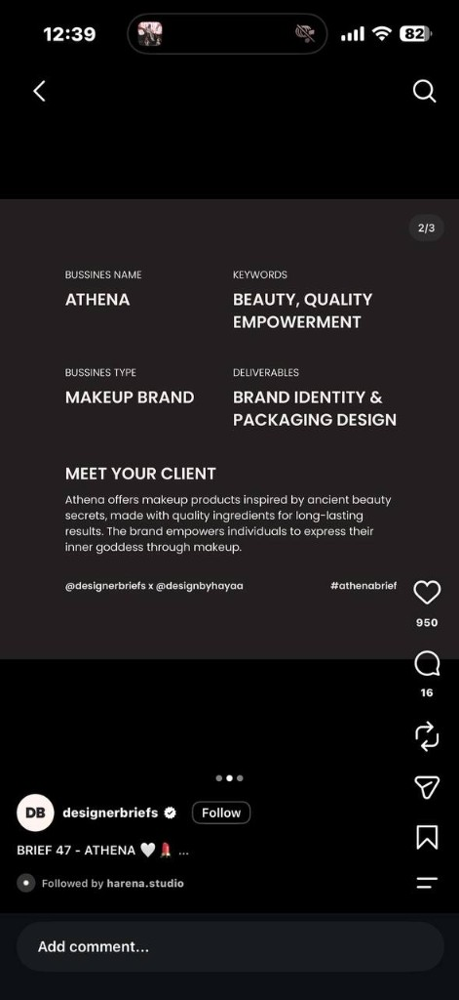

# 01 · Athena

Brand identity for Athena, a makeup brand, with packaging to follow. From designerbriefs Brief 47 (with @designbyhayaa), hashtag **#athenabrief**.

## The brief
- **Business:** Athena, a makeup brand
- **Keywords:** beauty, quality, empowerment
- **Deliverables:** brand identity and packaging design
- **Client:** "Athena offers makeup products inspired by ancient beauty secrets, made with quality ingredients for long-lasting results. The brand empowers individuals to express their inner goddess through makeup."

## Direction: Temple by candlelight
*Athena's temple at night: marble statues, gold and candlelight.*

It combines two of the four starting directions: the materials of **marble and gold** (marble, gold foil, Didone type) with the darkness and drama of **night oracle**. The moodboard confirmed it: about 70% of it is warm near-black and umber, about 20% is marble from the statues, and the rest is gold highlights.

Draft tagline: *Ancient secrets, lasting beauty.*

### Staying on direction
- **In:** marble statues in dramatic light, candlelit gold interiors, columns, satin and pearls in warm brown and gold, antique gold frames, gold eye makeup.
- **Out:** cream and pastel collages, butterflies, swans, clouds, bright "aesthetic yellow". That's the ethereal look (and the Cinnamoroll look), not this one.
- **Avoid:** statue and bust clip art, Trajan-style "toga party" lettering, and Medusa (the aegis carries her head, but she's Versace's logo).

### Athena's symbols, ranked
Five symbols, each with one job, so they never compete on one surface:

| Symbol | Job |
|---|---|
| Owl, helmet or olive | Hidden in the monogram (one of the three, decided in the logo round). The other two move down this table. |
| Owl | The signature product: a gold coin compact struck like an Athenian owl coin, with a beaded rim |
| Spear | Product shape: a slim lipstick with column flutes and a pointed, spear-tip cap |
| Cloak (aegis) | Photography only: draped satin behind the products |
| Olive | The ingredient story, in copy only |

## Identity system (working)

### Logo
Two parts, used together or apart:

- **Wordmark (main logo):** ATHENA in Bodoni Moda capitals, widely letterspaced. Start at about +250 tracking and adjust by eye. For box fronts, headers and the brand board.
- **Monogram (submark):** a mirrored calligraphic "A": one flowing, looping script stroke drawn once and flipped, so the mark is perfectly symmetrical and fine-lined. For compact lids, lipstick caps, embossing and the profile picture.

The monogram style comes from a blanchestudio_ submark on Instagram (an unused concept for a med spa). Borrow the style (symmetrical, calligraphic, fine line), never the shapes.

**Three monogram concepts to sketch and compare:**
1. **Hidden owl:** the two mirrored top loops curl into round loops that read as the owl's eyes, and the point where the strokes cross below them is the beak. An "A" first, an owl second. It ties straight into the coin compact.
2. **Helmet:** the strokes sweep up into the helmet's crest, and the space inside the "A" becomes the helmet's T-shaped face opening, like a Corinthian helmet seen from the front.
3. **Olive flourish:** a simpler mirrored "A" whose stroke ends finish in small olive leaves.

**Chosen: owl face from letters.** Two italic Didone "a"s set back to back (one mirrored) so the bowls become the owl's eyes, with a small "v" tucked between them as the beak. It's the hidden-owl idea built from real type, so the monogram shares its "a" with the wordmark. Studies in `exports/monogram-owl-letters-v3.png`:
- Tuck the beak up between the eyes; below them it reads as a mouth.
- Leave a small gap between the two bowls so each eye reads as its own shape.
- Optional: a dot in each bowl for pupils, and a beaded coin rim (like the Athenian owl coin) for the compact.

A stacked wordmark (AT / HE / NA in italic) is being tested alongside it as a secondary lockup.

**Earlier round: olive scrolls.** The olive concept, pushed further into curls and spirals (sketches: `exports/monogram-sketches-v1.png` for all three, `exports/monogram-olive-scrolls-v2.png` for this one). Parked; the spirals could come back as ornament:
- **Crown:** the legs cross at the apex and each rolls into a spiral, like the volutes on an Ionic column capital. A single olive leaf stands between them.
- **Crossbar:** a cupid's-bow curve (a nod to lips) whose ends cross the legs and curl into small spirals outside them.
- **Feet:** each leg winds into a spiral, with two olive leaves sprouting from it.

**Drawing it in Affinity:**
1. Draw only the **left half** with the Pen tool, as a single path.
2. Stroke it and give it a **variable-width profile** (Stroke panel → Pressure), thick on the downstrokes and thin on the upstrokes, like a calligraphy pen.
3. Duplicate it, **Flip Horizontal**, and line up the two halves on the centre line.
4. When the shape is final: Layer → **Expand Stroke** on both halves, then **Add** them into one shape.

Check every concept at two sizes before judging it: large, and about 16px (the size of a profile picture in a comment).

**Lockups:** the monogram stacked over the wordmark, the wordmark alone, and the monogram alone.

### Palette
| Name | Hex | Use | Share |
|---|---|---|---|
| Umber black | #25190F | Main background, packaging body | ~70% (with the two below) |
| Deep umber | #422F1D | Secondary surfaces | |
| Bronze shadow | #62503C | Mid-tones, borders | |
| Marble | #D7D6D5 | Text, the logo on dark | ~20% |
| Gilt | #C9A45C | Gold foil: monogram, borders, caps | ~10% |
| Rose madder | #A8474A | Hero lip shade, sparing accent | |

The first four are sampled from the moodboard. Gilt is a flat stand-in for foil on screen. For print, it becomes a spot colour (a gold foil block), not a CMYK mix.

### Type
- **Bodoni Moda**: wordmark and headlines
- **Jost**: body text, labels and product names (Marcellus is an alternative for small-caps labels)
- Both are free on Google Fonts under the SIL Open Font License, so they're fine for commercial use.

### Graphic elements
- **Greek-key border:** `identity/greek-key.svg`. One repeat is 11 units wide. Every gap between parallel lines equals 3 stroke widths, so scale it uniformly and never stretch it. Use it in Gilt, as a thin band only.
- **Coin beading:** a ring of small dots, like the rim of an ancient coin. For the compact and as a frame around the monogram.

## Phases
1. **Moodboard** (`source/`, Affinity): statues, candlelit interiors and gold materials are in. Still to add: gold compacts and an owl coin, a sculptural lipstick, a Corinthian helmet line drawing, and one gold eye makeup editorial. Set the artboard background to Umber black.
2. **Logo exploration:** one artboard with the three monogram concepts and the wordmark at three letterspacings. Pick one monogram.
3. **Refine:** optical letterspacing, the monogram at small sizes (16px on screen and an 8mm emboss), then the lockups, clear space and minimum size.
4. **System:** palette, type scale, border and beading, and the photo and render mood.
5. **Brand board and portfolio slides** (1080 × 1440).
6. **Packaging:** decided later (flat dielines only, or also 3D renders in cel.3d).

## Affinity setup
- Source file: `source/athena-identity.af`. Keep separate artboards for the moodboard, exploration, final logo and brand board.
- Logo artboards: 1000 × 1000px, RGB. Packaging will get its own CMYK document later.
- Export to `exports/`: SVG (preset **SVG (for export)**) for vectors and PNG @2x for previews.

## Progress
- [x] Pick a direction: Temple by candlelight (marble and gold, lit like night oracle)
- [ ] Moodboard: add products, helmet and eye makeup references
- [x] Logo exploration: three monogram concepts (owl, helmet, olive) and the wordmark. Chose an owl face built from mirrored italic a's
- [ ] Refine the chosen monogram, plus lockups
- [ ] Palette, type and graphic elements locked
- [ ] Brand board and portfolio slides
- [ ] Packaging scope decided
